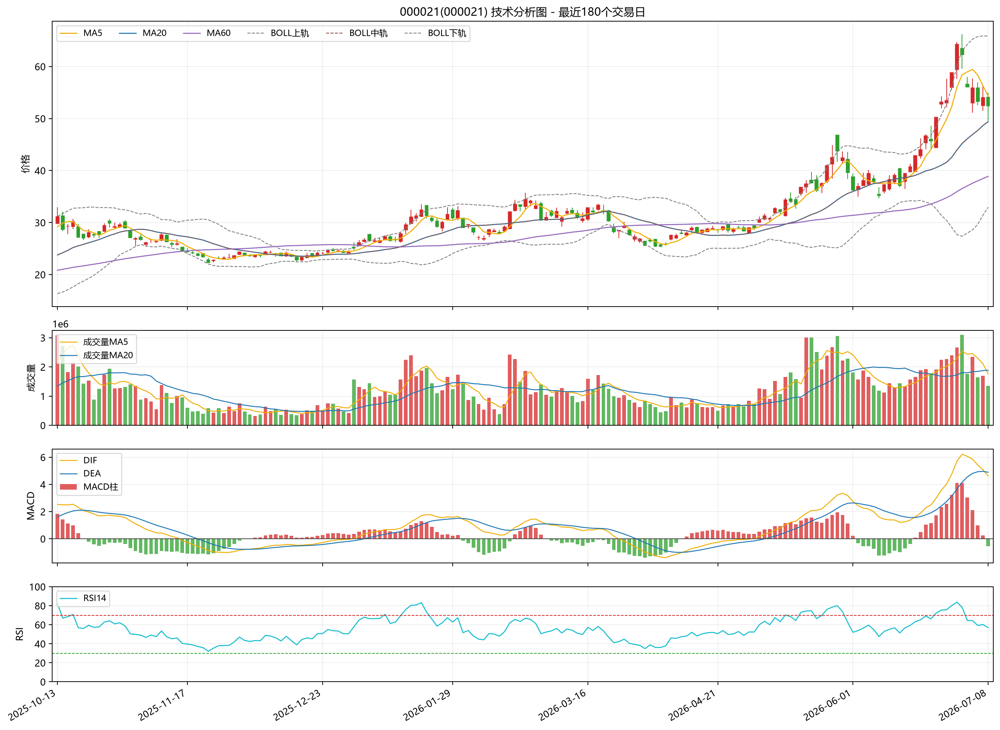

# 000021（000021）A股技术分析报告

生成时间：2026-07-08 13:54:56

数据源：akshare  
分析区间：2023-06-29 至 2026-07-08  
说明：本报告基于历史行情和常见技术指标自动生成，不构成确定性买卖建议。

## 核心数据概览

| 项目 | 数值 |
|---|---:|
| 最新收盘价 | 52.42 |
| 最新日涨跌幅 | -3.05% |
| 最近20个交易日累计涨跌幅 | 40.46% |
| 区间最大回撤 | -53.45% |
| 最新成交量 | 1354221 |
| 成交量较前一日变化 | -20.33% |
| MA5 / MA20 / MA60 | 54.35 / 49.41 / 38.88 |
| MACD DIF / DEA / 柱 | 4.6252 / 4.8959 / -0.5414 |
| RSI14 | 57.04 |

## 指标解读

- **K线图**：展示每个交易日的开盘、收盘、最高和最低价格，有助于观察价格波动结构和阶段性趋势。
- **MA5、MA20、MA60**：分别代表短期、中期和较长期均线。当前均线状态为“多头排列”，可用于观察趋势强弱与价格相对均线的位置。
- **MACD**：由 DIF、DEA 和柱状图组成，常用于观察趋势动能变化。当前状态为“MACD柱为负”，说明短中期动能正在发生相应变化，但需要结合价格和成交量确认。
- **RSI14**：衡量近14个交易日上涨和下跌力量的相对强弱。当前 RSI 位于“中性区间”，通常 70 以上视为偏热，30 以下视为偏弱。
- **布林带**：中轨通常为20日均线，上下轨反映波动范围。价格靠近上轨时说明短期较强或波动扩张，靠近下轨时说明短期承压或波动下移。
- **成交量变化**：当前成交量“低于20日均量”。成交量放大通常表示交易活跃度提升，但方向需要结合价格涨跌判断。
- **最大回撤**：区间最大回撤为 -53.45%，表示从阶段高点到后续低点的最大跌幅，是衡量历史下行风险的重要指标。

## 最近20个交易日涨跌幅

最近20个交易日累计涨跌幅：**40.46%**

| 日期 | 收盘价 | 当日涨跌幅 | 成交量 | 成交量较前日变化 |
|---|---:|---:|---:|---:|
| 2026-06-10 | 38.34 | 2.73% | 1447768 | 29.07% |
| 2026-06-11 | 39.08 | 1.93% | 1298237 | -10.33% |
| 2026-06-12 | 37.09 | -5.09% | 1445141 | 11.32% |
| 2026-06-15 | 39.47 | 6.42% | 1327926 | -8.11% |
| 2026-06-16 | 40.77 | 3.29% | 1563360 | 17.73% |
| 2026-06-17 | 42.91 | 5.25% | 1654931 | 5.86% |
| 2026-06-18 | 44.04 | 2.63% | 1886099 | 13.97% |
| 2026-06-22 | 46.68 | 5.99% | 1925259 | 2.08% |
| 2026-06-23 | 45.70 | -2.10% | 1773392 | -7.89% |
| 2026-06-24 | 50.27 | 10.00% | 1909993 | 7.70% |
| 2026-06-25 | 53.20 | 5.83% | 2244946 | 17.54% |
| 2026-06-26 | 53.51 | 0.58% | 2272892 | 1.24% |
| 2026-06-29 | 58.86 | 10.00% | 2396366 | 5.43% |
| 2026-06-30 | 64.27 | 9.19% | 2661147 | 11.05% |
| 2026-07-01 | 62.26 | -3.13% | 3101965 | 16.56% |
| 2026-07-02 | 56.03 | -10.01% | 1761593 | -43.21% |
| 2026-07-03 | 55.91 | -0.21% | 2351311 | 33.48% |
| 2026-07-06 | 53.30 | -4.67% | 1644910 | -30.04% |
| 2026-07-07 | 54.07 | 1.44% | 1699884 | 3.34% |
| 2026-07-08 | 52.42 | -3.05% | 1354221 | -20.33% |

## 风险提示

- 技术指标基于历史数据计算，不能预测未来价格，也不能替代基本面、估值、行业景气度和宏观环境分析。
- A股个股可能受政策、公告、业绩、流动性、市场情绪和突发事件影响，历史规律可能失效。
- 单一指标容易产生误判，应结合多周期、多指标和风险承受能力综合评估。
- 本报告仅用于量化研究和技术分析学习，不构成投资建议或收益承诺。
