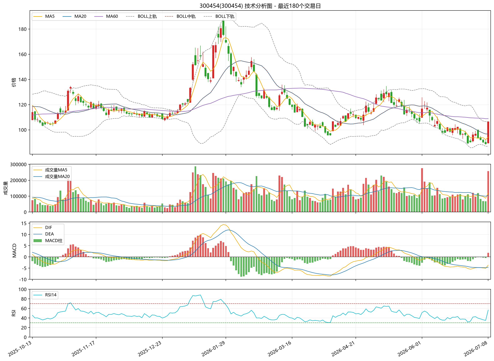

# 300454（300454）A股技术分析报告

生成时间：2026-07-08 14:28:38

数据源：akshare  
分析区间：2023-06-29 至 2026-07-08  
说明：本报告基于历史行情和常见技术指标自动生成，不构成确定性买卖建议。

## 核心数据概览

| 项目 | 数值 |
|---|---:|
| 最新收盘价 | 106.56 |
| 最新日涨跌幅 | 20.00% |
| 最近20个交易日累计涨跌幅 | -0.20% |
| 区间最大回撤 | -63.19% |
| 最新成交量 | 257215 |
| 成交量较前一日变化 | 280.87% |
| MA5 / MA20 / MA60 | 94.25 / 96.71 / 108.90 |
| MACD DIF / DEA / 柱 | -3.6640 / -4.5768 / 1.8256 |
| RSI14 | 56.66 |

## 指标解读

- **K线图**：展示每个交易日的开盘、收盘、最高和最低价格，有助于观察价格波动结构和阶段性趋势。
- **MA5、MA20、MA60**：分别代表短期、中期和较长期均线。当前均线状态为“非典型多头排列”，可用于观察趋势强弱与价格相对均线的位置。
- **MACD**：由 DIF、DEA 和柱状图组成，常用于观察趋势动能变化。当前状态为“MACD柱为正”，说明短中期动能正在发生相应变化，但需要结合价格和成交量确认。
- **RSI14**：衡量近14个交易日上涨和下跌力量的相对强弱。当前 RSI 位于“中性区间”，通常 70 以上视为偏热，30 以下视为偏弱。
- **布林带**：中轨通常为20日均线，上下轨反映波动范围。价格靠近上轨时说明短期较强或波动扩张，靠近下轨时说明短期承压或波动下移。
- **成交量变化**：当前成交量“放大”。成交量放大通常表示交易活跃度提升，但方向需要结合价格涨跌判断。
- **最大回撤**：区间最大回撤为 -63.19%，表示从阶段高点到后续低点的最大跌幅，是衡量历史下行风险的重要指标。

## 最近20个交易日涨跌幅

最近20个交易日累计涨跌幅：**-0.20%**

| 日期 | 收盘价 | 当日涨跌幅 | 成交量 | 成交量较前日变化 |
|---|---:|---:|---:|---:|
| 2026-06-10 | 100.58 | -5.80% | 112424 | -25.96% |
| 2026-06-11 | 97.89 | -2.67% | 84694 | -24.67% |
| 2026-06-12 | 97.76 | -0.13% | 88195 | 4.13% |
| 2026-06-15 | 101.81 | 4.14% | 93182 | 5.65% |
| 2026-06-16 | 98.57 | -3.18% | 97938 | 5.10% |
| 2026-06-17 | 101.31 | 2.78% | 108734 | 11.02% |
| 2026-06-18 | 101.21 | -0.10% | 96672 | -11.09% |
| 2026-06-22 | 102.29 | 1.07% | 109904 | 13.69% |
| 2026-06-23 | 96.22 | -5.93% | 112485 | 2.35% |
| 2026-06-24 | 96.59 | 0.38% | 78821 | -29.93% |
| 2026-06-25 | 96.20 | -0.40% | 100262 | 27.20% |
| 2026-06-26 | 89.30 | -7.17% | 111568 | 11.28% |
| 2026-06-29 | 90.32 | 1.14% | 87466 | -21.60% |
| 2026-06-30 | 96.20 | 6.51% | 121277 | 38.66% |
| 2026-07-01 | 96.77 | 0.59% | 96034 | -20.81% |
| 2026-07-02 | 93.70 | -3.17% | 119207 | 24.13% |
| 2026-07-03 | 92.04 | -1.77% | 83081 | -30.31% |
| 2026-07-06 | 90.16 | -2.04% | 68270 | -17.83% |
| 2026-07-07 | 88.80 | -1.51% | 67534 | -1.08% |
| 2026-07-08 | 106.56 | 20.00% | 257215 | 280.87% |

## 风险提示

- 技术指标基于历史数据计算，不能预测未来价格，也不能替代基本面、估值、行业景气度和宏观环境分析。
- A股个股可能受政策、公告、业绩、流动性、市场情绪和突发事件影响，历史规律可能失效。
- 单一指标容易产生误判，应结合多周期、多指标和风险承受能力综合评估。
- 本报告仅用于量化研究和技术分析学习，不构成投资建议或收益承诺。
