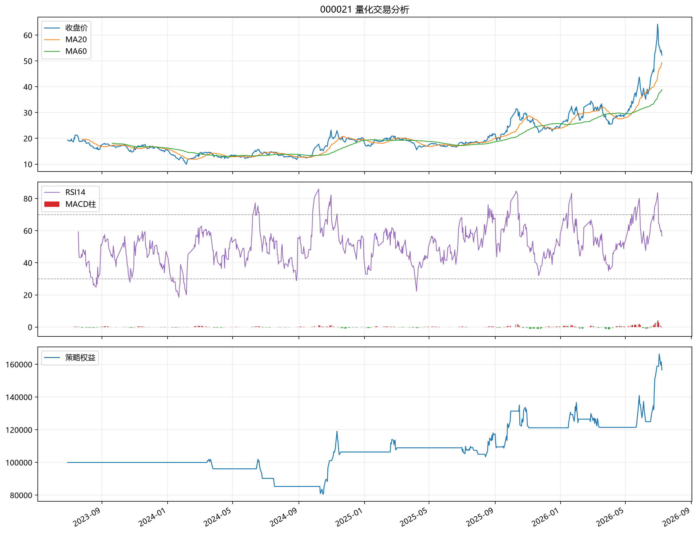

# 000021（000021）量化交易分析报告

生成时间：2026-07-08 14:09:42

本报告基于历史行情、技术指标和规则化回测生成，仅用于量化研究，不构成投资建议。

## 当前信号

- 综合评级：**偏积极**
- 信号得分：4/5
- 触发因素：收盘价站上MA20, MA20高于MA60, RSI处于趋势友好区间, 成交量20日均量高于60日均量
- 最新收盘价：52.25
- MA20 / MA60：49.40 / 38.88
- RSI14：56.73
- MACD柱：-0.5631
- 成交量扩张比：1.2068

## 策略规则

- 买入：收盘价站上 MA20、MA20 高于 MA60、MACD 柱为正、RSI14 在 45 到 70 之间、20日均量高于60日均量。
- 卖出：跌破 MA20、MA20 低于 MA60、RSI14 高于 80、触发止损或止盈。
- 交易执行：信号出现后的下一个交易日开盘价成交。

## 回测摘要

| 指标 | 数值 |
|---|---:|
| 回测区间 | 2023-06-29 至 2026-07-08 |
| 初始资金 | 100000.00 |
| 最终权益 | 156637.84 |
| 总收益率 | 56.64% |
| 年化收益率 | 15.98% |
| 最大回撤 | -21.04% |
| 夏普比率 | 0.7619 |
| 交易次数 | 19 |
| 胜率 | 47.37% |
| 盈亏比 | 2.1346 |

## 最近交易

|   trade_id | buy_date   |   buy_price |   shares | sell_date   |   sell_price |    profit |   return_pct |   holding_days | sell_reason   |
|-----------:|:-----------|------------:|---------:|:------------|-------------:|----------:|-------------:|---------------:|:--------------|
|         10 | 2025-09-16 |       21.61 |     4500 | 2025-09-30  |        26.53 |  21923.4  |      22.5219 |             14 | 触发25.0%止盈     |
|         11 | 2025-10-15 |       29.28 |     4000 | 2025-11-03  |        26.78 | -10224.2  |      -8.721  |             19 | 触发8.0%止损      |
|         12 | 2026-01-16 |       28.58 |     3800 | 2026-01-20  |        30.78 |   8134.43 |       7.4825 |              4 | 技术卖出信号        |
|         13 | 2026-01-26 |       30.3  |     3800 | 2026-02-03  |        29.61 |  -2849.66 |      -2.4725 |              8 | 技术卖出信号        |
|         14 | 2026-02-25 |       33.44 |     3400 | 2026-03-03  |        33.66 |    519.86 |       0.4568 |              6 | 触发8.0%止损      |
|         15 | 2026-03-05 |       32.2  |     3500 | 2026-03-16  |        30.68 |  -5540.08 |      -4.9109 |             11 | 技术卖出信号        |
|         16 | 2026-05-22 |       37    |     2900 | 2026-05-28  |        41.89 |  13952.2  |      12.99   |              6 | 技术卖出信号        |
|         17 | 2026-06-01 |       38.79 |     3100 | 2026-06-08  |        35.48 | -10491.2  |      -8.7159 |              7 | 触发8.0%止损      |
|         18 | 2026-06-18 |       42.85 |     2600 | 2026-06-29  |        56    |  33933    |      30.4273 |             11 | 触发25.0%止盈     |
|         19 | 2026-07-03 |       53    |     2600 | 2026-07-08  |        52.25 |  -2223.65 |      -1.6121 |              5 | 回测结束强制平仓      |

## 风险提示

- 历史回测不能预测未来收益，参数可能过拟合。
- A股个股受公告、政策、行业景气、流动性和市场情绪影响较大。
- 若最大回撤较高或夏普较低，不应单独依赖该策略做交易决策。
